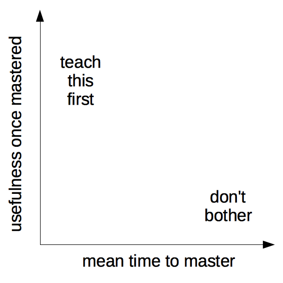

Motivation is important. You can implement all the best teaching practices we have discussed, but if the learners are not motivated it can all be a bit pointless. What's more, demotivation can be contagious not only to the other learners but can also negatively influence the teacher. It can be tempting, especially for teachers facing burnout after strenuous and ineffectual effort, to blame learners for spoiling the classroom experience.

It is true that learner motivation is influenced by many factors well beyond the control of an instructor, including individual background and systemic forces. However, there are many things you can do to cultivate motivation in your classroom, and perhaps most importantly, to avoid doing harm to the precious drive your learners bring to the classroom on day one. Most of the learners on the course have opted in, mostly by choice or perhaps by recommendation, so they are eager to learn. You have the power to influence how they feel when they depart. No short workshop can truly bring a total novice to the level of a competent practitioner. Our beginner workshops are designed to kick start someone's learning journey. They function in a context of self training, in which workshops offer vital tools and a map for learners to proceed on their own. Our workshops lower the barrier to entry and help learners to get off on the right foot. In this context, cultivating motivation to continue learning, and to carefully pursue best-practices in doing so, is arguably the most important outcome we can achieve.

This section discusses several ways that learners can be motivated (or demotivated!) by instructional content and approaches, and provides practice opportunities for you to become confident in motivating your learners.

## How can content influence motivation?

People learn best when they care about a topic and believe they can master it with a reasonable investment of time and effort. Many scientists might appreciate the value of programming but believe that developing useful skills will take more time than they have available. This presents a problem because believing that something will be too hard to learn often becomes a self-fulfilling prophecy.

One way to combat this problem is to begin a lesson with something that is quick to learn and immediately useful. It is particularly important that learners see it as useful in their daily work. This not only motivates them, it also helps build their confidence in us, so that if it takes longer to get to something they find useful in a later topic, they will persist with the lesson.

Imagine a graph whose axes are labelled "mean time to master" and "usefulness once mastered". Tasks that are quick to master and immediately useful should ideally be taught first; things in the opposite corner that are time-consuming to learn and have little near-term application should be avoided in our workshops.

Another way to think about the graph shown above is authentic tasks – real tasks performed by someone doing their work. If you can identify authentic tasks from your own work that could be useful to others, these examples will be highly motivating. The key here is that they are accessable such that anyone from any background can see the value.

While we aim to begin workshops with motivating content, in practice this does not always occur. Even when a ‘motivating example’ is built in to the start of a workshop, technical problems like software installation can turn those precious first minutes into an experience of frustration and impatience. That is ok! What is important is to be mindful of times when your content is not motivating, and to strategize your rescue using some of the other techniques in this section.

> **Group activity**
> 
> Think about some task you did this week that uses a skill you would want to teach a beginner, (e.g. wrote a function, bulk downloaded data, built a plot, forked a repo) and explain how you would use it (or a simplified version of it) as an exercise or example in class. 
> Pair up with your neighbor and decide where this exercise fits on a graph of “short/long time to master” and “low/high usefulness”. 
> 

## Strategies to postively influence motivation

### Invite Participation

Motivation is supported by active engagement. Participation allows learners to ask questions, resolving roadblocks quickly, and demonstrate knowledge, building confidence. It also facilitates learning! However, in a room full of strangers, most learners will not immediately feel comfortable speaking up, especially when they feel confusion or doubt. Creating a motivating classroom means inviting communication and reinforcing that invitation with an attentive response.

A few ways to invite participation are:

* **Establishing norms for interaction.** This can be done by creating procedures for communication, e.g. turn taking in discussions, passing around a ‘talking stick’, or encouraging quieter people to contribute. Having, discussing, and enforcing a Code of Conduct also provides a framework for positive communication to occur.
* **Encouraging learners to learn from each other.** Working in pairs, or "pair programming", encourages learners to talk through their learning process, reinforcing memory and making it more likely that confusion will be expressed and resolved. This can also address challenges of varying background experience: asking more advanced learners to help beginners can maximize learning for both. In these cases, make sure the beginner is doing the typing!
* **Acknowledging when learners are confused.** Acknowledging and exploring confusion with kindness rewards learners for sharing vulnerable information. It also helps you examine your expert awareness gaps! Formative assessments can pinpoint misunderstandings. When learners see that others are confused, they are more likely to share their own uncertainties.
* **Provide oppotunities for learner to ask questions in a one-on-one setting.** Some learner might not feel comfortable asking a question in front of the whole group, for fear of embarassing themselves. During activities (when the rest of the class is destracted) they may feel more comfortable, furthermore, they may also find it easier to interact with the workshop helpers. Encourage the helpers to approach the learners and check in with them. When someone does appraoch you in this way, make an effort to validate their query and next time they might have more confidence to ask it in front of the group. 
* **Provide a way to ask questions non-verbally.** The ability to write down a question, gives someone more time to consider how they phrase it. Having a collaborative document available can provide a forum for those who don't want to raise their hand and speak in front of the class.
* **Encourage the helpers to ask questions if they are confused.** Seeing someone who you consider as an expert or more competent than you can be reassuring, and enable your learners to realise that it is acceptable to accept there are things you don't know. 

### Encourage a growth mindset

People vary in their beliefs about the nature of intelligence and skill development. In academic environments, people are often praised as "talented" or having "high ability" and may develop an identity around being a certain "type of person" who has inherent strengths or weaknesses. 

The belief that ability or intelligence is born rather than made – dubbed a fixed mindset by Carol Dweck – may impact the learning process. Broadly, this is a continuing topic of research and debate in education communities. In the specific context of programming workshops, we frequently encounter learners who believe that they are not "computational people" and Instructors often report that this fixed mindset interferes with motivation to engage fully with the task of learning to program. We therefore recommend three types of interventions that have been shown to influence mindset, encouraging learners to believe that ability can be acquired through effort – a growth mindset.

* **Positive error framing.** Errors are inevitable when learning a new skill. However, learners will often interpret errors as indicators of inability – adopting a fixed mindset. Encouraging learners to understand errors in a positive way – as an opportunity to learn something they would have missed otherwise – reinforces a growth mindset and helps them to stay motivated. Be sure to discuss this with your helpers, since they are often the ‘first responders’ to learner mistakes.
* **Presenting the instructor as a learner.** We want our learners to have confidence in our qualifications, but it is easy to take this too far. Presenting yourself as a learner offers a relatable model, fostering a growth mindset and teaching a positive approach to the continuing challenge of learning. Using participatory live coding, our chosen method for teaching concepts, is very useful for this reason. It is common to make errors while coding. Embrace these with enthusiasm! Leveraging your own mistakes as opportunities can turn an awkward moment into a highlight of a lesson, demonstrating both problem-solving approaches and positive error framing. If you are unlucky and fail to make any useful mistakes, sharing stories about your learning process can help here, too.
* **Praising effort or improvement, not performance or ability.** Praise based on the quality of performance often feels like the highest praise because it goes straight to your identity as a person of intellect and skill. When faced with a fixed mindset ("I’m not a computational person!"), many well-intentioned teachers counter with another fixed mindset ("You ARE a computational person! You’re really good at this!"). However, this doesn’t prepare learners to interpret future obstacles as irrelevant to innate ability. Evidence suggests that learner perseverance is best supported in the long term by praising effort or improvement instead. If you are not convinced of this, consider the impact on the person sitting next to your target, who might overhear but not receive the same praise.
* **Leveraging the Power of "Yet".** A request for help might start with “I can’t __ “ or “I don’t understand __ “. Depending on the attitude of the learner, these can sound like statements of fact rather than requests for help! Adding the word “yet” to the end of these sentences helps emphasize that being a novice is a temporary state, and encourages a growth mindset towards progress.

## Avoiding demotivation

When learning a skill, we develop more than expert awareness gaps – we also develop opinions about tools and methods, and sometimes base a professional identity around displaying technical expertise. Technical boasts, insults, and other showy moves can score points in conversation with fellow experts, but these present serious hazards in the classroom. Here are a few things you should avoid during your workshop:

* **Talk contemptuously or with scorn about any tool or practice, or the people who use them.** Regardless of its shortcomings, many of your learners may be using that tool, and may have invested many years in learning to do so. Convincing someone to change their practices is much harder when they think you disdain them.
* **Dive into complex or detailed technical discussion with the one or two people in the audience who clearly don’t actually need to be there.** Reserve those conversations for breaks or follow-up emails.
* **Pretend to know more than you do.** People will actually trust you more if you are frank about the limitations of your knowledge, and will be more likely to ask questions and seek help. 
* **Use the J word (“just”) or other demotivating words.** These signal to the learner that the instructor thinks their problem is trivial and by extension that they therefore must be deficient if they are not able to figure it out.
* **Take over the learner’s keyboard.** It is rarely a good idea to type anything for your learners. Doing so can be demotivating for the learner (as it implies you don’t think they can do it themselves or that you don’t want to wait for them). It also wastes a valuable opportunity for your learner to develop muscle memory and other skills that are essential for independent work.
* **Express surprise at unawareness.** Saying things like “I can’t believe you don’t know X” or “You’ve never heard of Y?” signals to the learner that they do not have some required pre-knowledge of the material you are teaching, that they don’t belong at the workshop, and it may prevent them from asking questions in the future. 

It can be difficult to avoid these demotivators entirely. Some people are so used to complaining about certain tools that they initially fail to realize they’re doing it while teaching. If you catch yourself doing this, you might find a way to walk it back, or consider how you might repair or improve your motivational efforts on your next interaction. Teaching yourself – and your helpers! – to avoid these types of comments takes practice, but is well worth the effort.

## Motivation to teach

What we have not discussed yet is strategies to motivate the instructor. But why does your motivation matter?

* **Learners respond to an instructor’s enthusiasm.** The more motivated you are, the more motivated they will be!
* **Instructors are learning to teach.** This takes motivation, too! Deliberative practice, seeking feedback, and reflecting on mistakes in the context of your own busy work life is a challenge. What will keep you energized to stay engaged with your learning process?
* **You teach because you want to.** Whether this is something you do at the margins of your current role, an doppotunity you delibrately sort out or are fulfilling a role in a job you have chosen, teaching is something you came here motivated to do. Teaching can be an incredibly gratifying activity! Finding and preserving your own motivation through the many challenges ahead will make your journey as a teacher a more joyful one.

